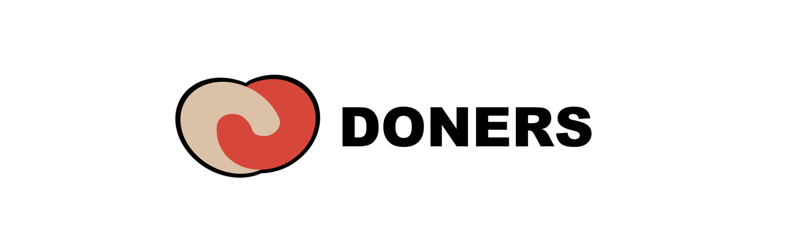

   
  
   
  <h1>기부하고 NFT 받기</h1>
   

## 목차

1. [**서비스 소개**](#1)
2. [**기술 스택**](#2)
3. [**시스템 아키텍처**](#3)
4. [**주요 기능**](#4)
5. [**UCC 보러가기**](#5)
6. [**협업 관리**](#6)
7. [**팀원 소개**](#7)
8. [**프로젝트 기간**](#8)
9. [**프로젝트 관련 문서**](#9)

 

## 💡 서비스 소개
> 사회적으로 힘든 여러 계층에 대한 모금 서비스와 모금 참여자들(NFT소유)만의 커뮤니티 형성 및 혜택 제공

 

## 🛠️ 기술 스택
     
     
   
   

 <b> 상세 기술 스택 및 버전</b> 

| 범위           | 기술 스택       | 상세               | 버전        |
| -------------- | --------------- | ------------------ | ----------- |
| **공통**           | 버전 컨트롤     | Gitlab             |             |
|                | 이슈 관리       | Jira               |             |
|                | 커뮤니케이션    | Mattermost, Notion |             |
| **BackEnd**        | DB              | MySQL              | 5.7         |
|                | JDK             | Zulu               | 8.33.0.1    |
|                | spring          | spring boot        | 2.6.4       |
|                | IDE             | Eclipse            | JEE 2020-06 |
|                |                 | Intellij           | 2021.03     |
|                | 빌드 툴         | Gradle             | 7.3.3       |
| **FrontEnd**       | HTML5           |                    |             |
|                | CSS3            |                    |             |
|                | JavaScript(ES6) |                    |             |
|                | TypeScript      |                    |             |
|                | React           | React              | 17.0.2      |
|                | React           | Recoil             | 0.6.1       |
|                | IDE             | Visual Studio Code |             |
|                | React           | PostCSS            |             |
| **Server**         | 서버            | AWS EC2            |             |
| **DevOps**         | CI/CD           | Docker             |             |
|                | CI/CD           | Jenkins            |             |
| **Smart-Contract** | Solidity        | Solidity           | ^0.8.0      |
|                | Truffle         | Truffle            | 5.5.6       |
|                | Web3.js         | Web3.js            | 1.7.1       |

 

## 🗂️ 시스템 아키텍처

 

## 🖥️ 주요 기능

 

## 🎥 [UCC 보러가기]()

 

## 👥 협업 관리

 

## 👪 팀원 소개
<table>
    <tr>
        <td height="140px" align="center"> <a href="https://github.com/">
                👑 손창현  (Back-End) </a>  </td>
        <td height="140px" align="center"> <a href="https://github.com/">
                🙂 박기범  (Back-End) </a>  </td>
        <td height="140px" align="center"> <a href="https://github.com/">
                😆 정홍진  (Back-End) </a>  </td>
        <td height="140px" align="center"> <a href="https://github.com/">
                😁 송민수  (Front-End) </a>  </td>
        <td height="140px" align="center"> <a href="https://github.com/">
                🙄 신지우  (Front-End) </a>  </td>
        <td height="140px" align="center"> <a href="https://github.com/">
                😶 이선민  (Front-End) </a>  </td>
    </tr>
    <tr>
        <td align="center">REST API CI/CD Infra </td>
        <td align="center">REST API</td>
        <td align="center">REST API</td>
        <td align="center">React</td>
        <td align="center">React</td>
        <td align="center">React</td>
    </tr>
</table>

 

## 📆 프로젝트 기간
### 22.2.21 ~ 22.4.8
- 기획 및 설계 : 22.2.21 ~ 22.3.11
- 프로젝트 구현 : 22.3.14 ~ 22.4.
- 버그 수정 및 산출물 정리 : 22.4. ~ 8

 

## 📋 프로젝트 관련 문서
|  구분  |  링크  |
| :--------------- | :---------------: |
| 기획안 | [기획안 바로가기](/docs/기획안.md) |
| 요구사항 명세서 | [요구사항 명세서 바로가기](/docs/요구사항 명세서.md) |
| 기능정의서 | [기능정의서 바로가기](/docs/기능정의서.md) |
| 기술스택 | [기술스택 바로가기](/docs/기술스택.md) |
| ERD | [ERD 바로가기](/docs/ERD.md) |
| 공통코드 | [공통코드 바로가기](/docs/공통코드.md) |
| 와이어프레임 | [와이어프레임 바로가기](/docs/와이어프레임.md) |
| 컨벤션 | [컨벤션 바로가기](/docs/컨벤션.md) |
| 포팅매뉴얼 | [포팅매뉴얼 바로가기](/exec/서울_4반_A404_포팅매뉴얼.pdf) |
| 외부서비스 정보 | [외부서비스 정보 바로가기](/exec/서울_4반_A404_외부서비스_정보.pdf) |
| 시연 시나리오 | [시연 시나리오 바로가기](/exec/서울_4반_A404_시연시나리오.pdf) |
| 발표자료 | [발표자료 바로가기](/docs/서울_4반_A404_발표자료.pdf) |
