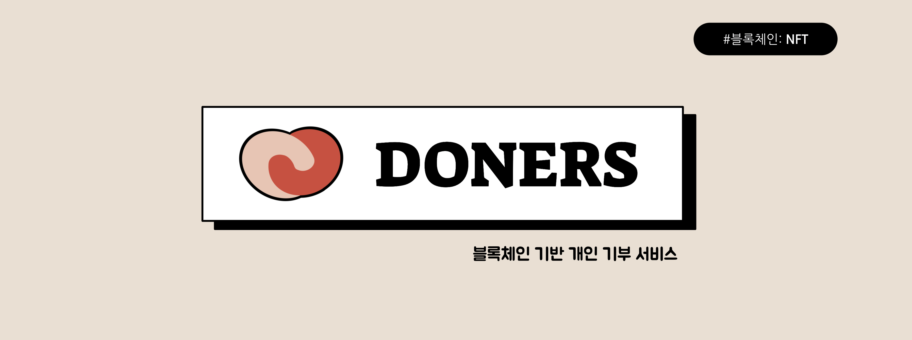
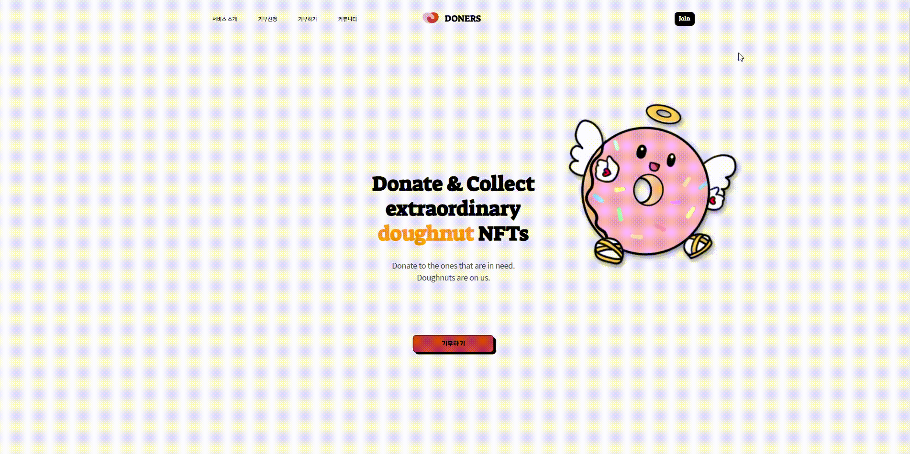
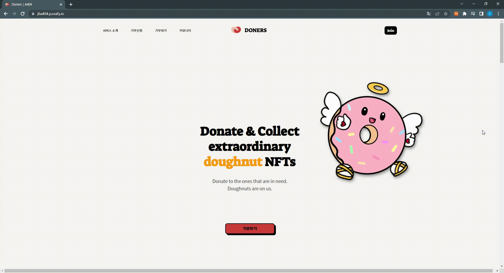

   
  
   
   

## 목차

1. [**서비스 소개**](#1)
2. [**UCC 보러가기**](#2)
3. [**프로젝트 기간**](#3)
4. [**팀원 소개**](#4)
5. [**기술 스택**](#5)
6. [**시스템 아키텍처**](#6)
7. [**주요 기능**](#7)
8. [**프로젝트 관련 문서**](#8)

  

## 💡 서비스 소개

### 투명한 기부, Doners와 함께 하세요 😎

> [코로나19, 희귀질환, 참전용사, 미혼모/부]  도움을 간절히 바라는 분들이 계십니다.  
> 사연을 읽고 그들에게 힘을 주세요. 사연에 대한 진실은 자료를 통해 직접 판단하실 수 있습니다.  
> 
> 기부 천사 당신에게는 다양한 혜택과 Doners만의 귀엽고 소중한 NFT를 발행해 드립니다!  
> NFT를 가지고 국내 수많은 기부 천사들과 소통하며 선한 영향력을 행사해 주세요!!  
>
> 서로가 서로를 돕는 세상, Doners가 만들어갑니다💗

  

## 🎥 [UCC 보러가기]()

  

## 📆 프로젝트 기간
### 22.02.21 ~ 22.04.08
- 기획 및 설계 : 22.02.21 ~ 22.03.11
- 프로젝트 구현 : 22.03.14 ~ 22.04.06
- 버그 수정 및 산출물 정리 : 22.04.06 ~ 22.04.08

  

## 👪 팀원 소개
<table>
    <tr>
        <td height="140px" align="center"> <a href="https://github.com/changhyuns">
                👑 손창현  (Back-End) </a>  </td>
        <td height="140px" align="center"> <a href="https://github.com/kibum414">
                🙂 박기범  (Back-End) </a>  </td>
        <td height="140px" align="center"> <a href="https://github.com/JeongHongJin">
                😆 정홍진  (Back-End) </a>  </td>
        <td height="140px" align="center"> <a href="https://github.com/thdalstn6352">
                😁 송민수  (Front-End) </a>  </td>
        <td height="140px" align="center"> <a href="https://github.com/eazae">
                🙄 신지우  (Front-End) </a>  </td>
        <td height="140px" align="center"> <a href="https://github.com/j-ij-i">
                😶 이선민  (Front-End) </a>  </td>
    </tr>
    <tr>
        <td align="center">REST API CI/CD Infra </td>
        <td align="center">REST API Security Database </td>
        <td align="center">REST API Smart Contract Web3 API </td>
        <td align="center">UI/UX Atomic Design </td>
        <td align="center">UI/UX NFT Contract Web3 API </td>
        <td align="center">UI/UX  </td>
    </tr>
</table>

  

## 🛠️ 기술 스택
        

      

     

       

     

 <b> 상세 기술 스택 및 버전</b> 

| 범위           | 기술 스택       | 상세               | 버전        |
| -------------- | --------------- | ------------------ | ----------- |
| **공통**           | 버전 컨트롤     | Gitlab             |             |
|                | 이슈 관리       | Jira               |             |
|                | 커뮤니케이션    | Mattermost, Notion |             |
| **BackEnd**        | DB              | MySQL              | 5.7         |
|                | JDK             | Zulu               | 8.33.0.1    |
|                | spring          | spring boot        | 2.6.4       |
|                | IDE             | Eclipse            | JEE 2020-06 |
|                |                 | Intellij           | 2021.03     |
|                | 빌드 툴         | Gradle             | 7.3.3       |
| **FrontEnd**       | HTML5           |                    |             |
|                | CSS3            |                    |             |
|                | JavaScript(ES6) |                    |             |
|                | TypeScript      |                    |             |
|                | React           | React              | 17.0.2      |
|                | React           | Recoil             | 0.6.1       |
|                | IDE             | Visual Studio Code |             |
|                | React           | PostCSS            |             |
| **Server**         | 서버            | AWS EC2            |             |
| **DevOps**         | CI/CD           | Docker             |             |
|                | CI/CD           | Jenkins            |             |
| **Smart-Contract** | Solidity        | Solidity           | ^0.8.0      |
|                | Truffle         | Truffle            | 5.5.6       |
|                | Web3.js         | Web3.js            | 1.7.1       |

  

## 🗂️ 시스템 아키텍처

  

## 🖥️ 주요 기능 

### 회원가입 / 로그인 (메타마스크 지갑 연동)
- 메타마스크 지갑 주소로 회원가입을 진행하고 
  로그인할 때 현재 메타마스크 정보를 가져와서 로그인을 수행한다.

|                              회원가입(메타마스크)                       |
| :---------------------------------------------------------------------------: |
|    |

|                              로그인(메타마스크)                       |
| :---------------------------------------------------------------------------: |
|    |

 

### 기부 요청 (관리자 승인 후 진행)
- 관리자 및 여러 사용자들이 확인할 수 있는 증빙 자료들과  
  신청 내용, 기부금 활용 계획 등 다양한 정보를 제출하여 기부를 요청한다.

|                              기부 요청                       |
| :---------------------------------------------------------------------------: |
|    |

|                              관리자 승인                       |
| :---------------------------------------------------------------------------: |
|    |

 

### 기부, NFT 지급 (프로필)
- 관리자로부터 승인이 완료된 기부 요청글 중 기부하고 싶은 개인에게 원하는 금액만큼 기부한다. (SSF 싸피 토큰 사용)   
  기부를 완료하고 나면 NFT를 지급받고, 마이페이지에서 확인할 수 있다.

|                              기부하기 + 프로필 확인                       |
| :---------------------------------------------------------------------------: |
|    |

 

### 사용자 커뮤니티
- 기부 내역이 있거나 기부금 수령 내역이 있는 사용자 한정으로 커뮤니티를 이용한다.  
  이벤트성으로 다양한 혜택들을 제공할 수 있고, Discord 커뮤니티를 통해서 NFT 소지자끼리의 공간도 이용한다.

|                              사용자 커뮤니티                       |
| :---------------------------------------------------------------------------: |
|    |

  

## 📋 프로젝트 관련 문서
|  구분  |  링크  |
| :--------------- | :---------------: |
| 기획안 | [기획안 바로가기](/docs/기획안.md) |
| 요구사항 명세서 | [요구사항 명세서 바로가기](/docs/요구사항 명세서.md) |
| 기능정의서 | [기능정의서 바로가기](/docs/기능정의서.md) |
| 기술스택 | [기술스택 바로가기](/docs/기술스택.md) |
| ERD | [ERD 바로가기](/docs/ERD.md) |
| 공통코드 | [공통코드 바로가기](/docs/공통코드.md) |
| 와이어프레임 | [와이어프레임 바로가기](/docs/와이어프레임.md) |
| 컨벤션 | [컨벤션 바로가기](/docs/컨벤션.md) |
| 포팅매뉴얼 | [포팅매뉴얼 바로가기](/exec/서울_4반_A404_포팅매뉴얼.pdf) |
| 외부서비스 정보 | [외부서비스 정보 바로가기](/exec/서울_4반_A404_외부서비스정보.pdf) |
| 시연 시나리오 | [시연 시나리오 바로가기](/exec/서울_4반_A404_시연시나리오.pdf) |
| 발표자료 | [발표자료 바로가기](/docs/서울_4반_A404_발표자료.pdf) |
